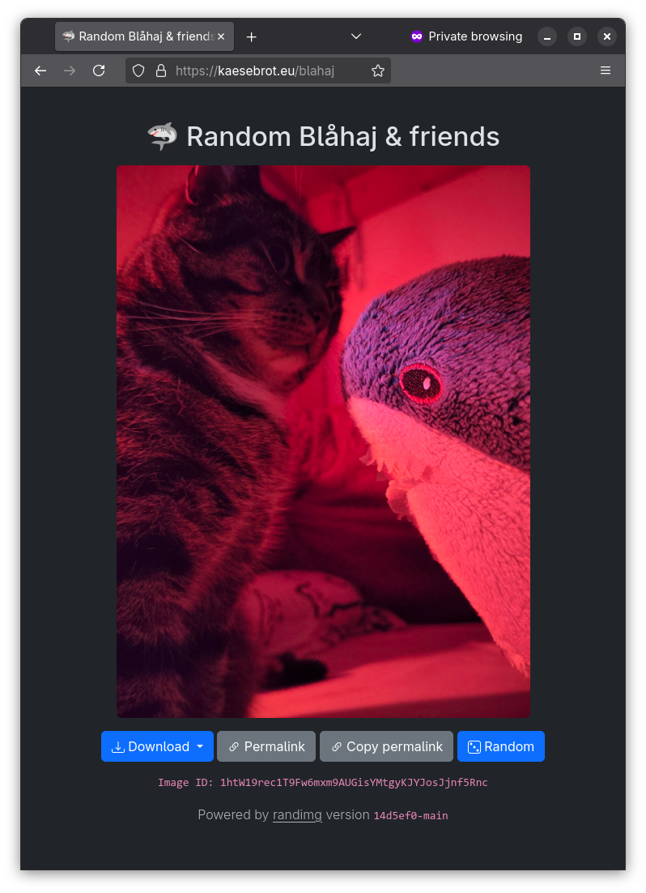

# randimg

A web service that displays a random image, made primarily to show random pictures of [Blåhaj](https://en.wikipedia.org/wiki/Bl%C3%A5haj) on my website [kaesebrot.eu/blahaj](https://kaesebrot.eu/blahaj) :)

<p align="center" width="100%">
    </img>
</p>

## Features
- [x] on-the-fly cached image generation for different resolutions
- [x] deterministic image IDs that are calculated from the pixel values, not the file bytes: an image will always receive the same ID
- [x] privacy-focused: all EXIF tags are stripped from hosted images
- [x] [Open Graph protocol](https://ogp.me/) integration for link previews
- [x] [inotify](https://linux.die.net/man/7/inotify)-based watchfolder support: images are automatically added/removed when copied/deleted to/from the input folder
- [ ] optimized slim page responses for crawlers (return just Open Graph tags and the html header)
- [ ] gallery page
- [ ] pageable image API
- [ ] responsive page UI with focus on mobile usage
- [ ] as few HTML/CSS/Javascript dependencies as possible

## Deployment
The service is available as a container on Docker hub: https://hub.docker.com/r/daskaesebrot/randimg
```bash
docker pull daskaesebrot/randimg
```

## Configuration
You may configure the web service via environment variables.

### Environment variables
| Variable name | Description | Default value | Required? |
| - | - | - | - |
| `RANDIMG_IMAGE_DIR` | Where to load the images to display from. Supperted file types: `jpg` and `png` | `assets/images` (in Docker: `/var/assets`) | No |
| `RANDIMG_CACHE_DIR` | Where to save the cached images (converted/resized) | `cache` | No |
| `RANDIMG_SITE_TITLE` | The site title to use | `Random image` | No |
| `RANDIMG_SITE_EMOJI` | The site emoji (used for the favicon and title) | `🦈` | No |
| `RANDIMG_DEFAULT_CARD_IMAGE` | The image ID to use as the [Open Graph](https://ogp.me/) thumbnail for the root view (`/`) | The (alphabetically) first ID | No |
| `RANDIMG_LOG_LEVEL` | The log level (uses `UVICORN_LOG_LEVEL` as fallback if unset, then uses default value) | `INFO` | No |
| `FORWARDED_ALLOW_IPS` | Reverse proxies to trust (see [Uvicorn docs](https://www.uvicorn.org/settings/)) | `127.0.0.1` | No |

### Additional HTML head/footer tags
If you'd like to add additional tags in the `<head>` section or `<footer>` section of the rendered page, you may create the following files in the folder `templates/custom`:

| Tag | Filename | Remarks |
| - | - | - |
| `<head>` | `head.html` | Inserted before closing `<head>` tag |
| `<footer>` | `footer.html` | Inserted before closing `<footer>` tag |

## Open Source License Attribution

This application uses Open Source components. You can find the source code of their open source projects along with license information below. We acknowledge and are grateful to these developers for their contributions to open source.


### [FastAPI](https://fastapi.tiangolo.com/)
- Copyright (c) 2018 Sebastián Ramírez
- [MIT license](https://github.com/fastapi/fastapi/blob/master/LICENSE)

### [Pillow](https://github.com/python-pillow/Pillow)
- Copyright (c) 2010 by Jeffrey A. Clark and contributors
- [MIT-CMU license](https://github.com/python-pillow/Pillow/blob/main/LICENSE)

### [Jinja](https://github.com/pallets/jinja)
- Copyright (c) 2007 Pallets
- [BSD 3-Clause license](https://github.com/pallets/jinja/blob/main/LICENSE.txt)

### [inotify](https://github.com/dsoprea/PyInotify)
- Copyright (c) [Dustin Oprea](https://github.com/dsoprea) and [other contributors](https://github.com/dsoprea/PyInotify/graphs/contributors)
- [GPL-2.0 license](https://github.com/dsoprea/PyInotify/blob/master/LICENSE)

### [Flake8](https://github.com/PyCQA/flake8)
- Copyright (c) 2011-2013 Tarek Ziade <tarek@ziade.org>
- [Flake8 license (MIT)](https://github.com/PyCQA/flake8/blob/main/LICENSE)

### [pytest](https://github.com/pytest-dev/pytest)
- Copyright (c) 2004-present [Holger Krekel](https://github.com/hpk42) and [other contributors](https://github.com/pytest-dev/pytest/blob/main/AUTHORS)
- [MIT license](https://github.com/pytest-dev/pytest/blob/main/LICENSE)
